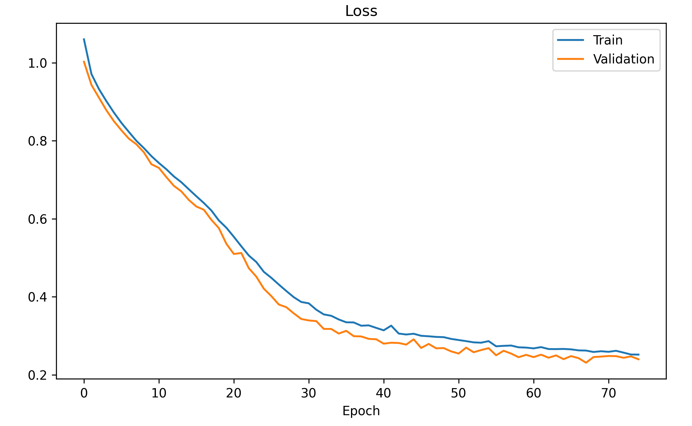
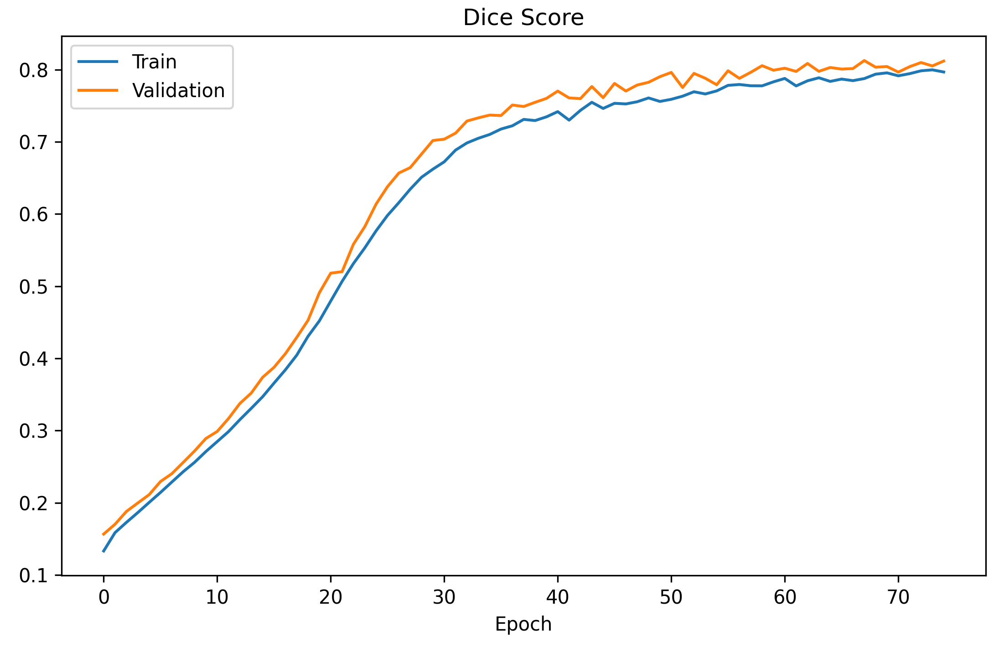
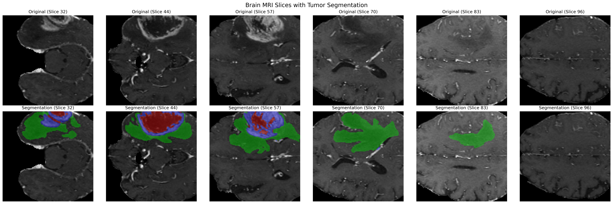

# RobustTransSeg

**Implementation and Comparison of CNN and Transformer-Based Architectures for Brain Tumor Segmentation**

## Overview
This project implements and compares two different approaches for brain tumor segmentation using the BraTS 2020 dataset:
1. A CNN-based approach using 3D UNet architecture
2. A hybrid Transformer+CNN approach with dual encoders and feature fusion

The goal is to evaluate and compare these established methodologies, providing insights into their performance on the challenging task of brain tumor segmentation.

## BraTS Dataset
The Brain Tumor Segmentation (BraTS) 2020 dataset is a comprehensive collection of multi-modal MRI scans:

### Data Characteristics
- **Number of cases**: 369 training cases
- **Image Resolution**: 240 x 240 x 155
- **MRI Modalities**:
  - T1: Basic T1-weighted scan
  - T1ce: T1-weighted scan with contrast enhancement (highlights active tumor)
  - T2: T2-weighted scan (shows tumor and edema)
  - FLAIR: Fluid Attenuated Inversion Recovery (highlights edema)

### Tumor Regions
The dataset provides pixel-wise annotations for three tumor regions:
1. **Enhancing Tumor (ET)**: Areas showing contrast enhancement in T1ce
2. **Tumor Core (TC)**: Includes enhancing tumor, necrotic parts, and non-enhancing tumor
3. **Whole Tumor (WT)**: Encompasses tumor core and peritumoral edema

### Data Preprocessing
- Intensity normalization using z-score standardization
- Cropping to 128x128x128 to focus on brain region
- Data augmentation:
  - Random flips (probability: 0.5)
  - Random rotations (90-degree increments)
  - Intensity shifts and scaling

## Model Architectures

### 3D UNet Architecture
A volumetric segmentation network with symmetric encoder-decoder structure:

#### Encoder
```
Input (3, 128, 128, 128)
│
├── Conv Block 1 (16 channels)
│   ├── Conv3D(3→16) + BN + ReLU
│   ├── Conv3D(16→16) + BN + ReLU
│   └── Dropout(0.1)
│
├── MaxPool3D ↓
├── Conv Block 2 (32 channels) + Dropout(0.1)
├── MaxPool3D ↓
├── Conv Block 3 (64 channels) + Dropout(0.2)
├── MaxPool3D ↓
├── Conv Block 4 (128 channels) + Dropout(0.2)
├── MaxPool3D ↓
└── Conv Block 5 (256 channels) + Dropout(0.3)
```

#### Decoder
```
Conv Block 5
│
├── UpConv4 + Skip Connection from Conv4
│   └── Conv Block (128 channels)
│
├── UpConv3 + Skip Connection from Conv3
│   └── Conv Block (64 channels)
│
├── UpConv2 + Skip Connection from Conv2
│   └── Conv Block (32 channels)
│
├── UpConv1 + Skip Connection from Conv1
│   └── Conv Block (16 channels)
│
└── Final Conv3D (4 output channels)
```

### Dual Encoder U-Net Architecture (Optimized Implementation)
Combining Transformer and CNN capabilities with parameter-efficient design:

#### Dual Encoder Structure
1. **CNN Encoder Path**:
   ```
   Input (3, 128, 128, 128)
   │
   ├── Conv Block 1 (8 channels)
   │   ├── Conv3D(3→8) + BN + ReLU
   │   ├── Conv3D(8→8) + BN + ReLU
   │   └── Dropout(0.1)
   │
   ├── MaxPool3D ↓
   ├── Conv Block 2 (16 channels) + Dropout(0.1)
   ├── MaxPool3D ↓
   ├── Conv Block 3 (32 channels) + Dropout(0.15)
   ├── MaxPool3D ↓
   ├── Conv Block 4 (64 channels) + Dropout(0.15)
   └── MaxPool3D ↓
   ```

2. **Transformer Encoder Path**:
   ```
   Input (3, 128, 128, 128)
   │
   ├── Patch Embedding (3→24)
   │
   ├── Swin Transformer Block (Level 1, 24 channels)
   │   └── Window Attention + MLP
   │
   ├── Downsampling ↓
   ├── Swin Transformer Block (Level 2, 24 channels)
   │
   ├── Downsampling ↓
   ├── Swin Transformer Block (Level 3, 48 channels)
   │
   ├── Downsampling ↓
   └── Swin Transformer Block (Level 4, 96 channels)
   ```

3. **Feature Fusion**:
   ```
   For each level:
   │
   ├── CNN Features
   ├── Transformer Features
   │
   ├── Feature Alignment (if sizes differ)
   │   └── Interpolation to match spatial dimensions
   │
   ├── NFCE Block
   │   ├── Channel Projection (if needed)
   │   ├── Feature Addition
   │   ├── Depth-wise Separable Conv
   │   └── Residual Connection
   │
   └── Fused Features
   ```

#### Decoder
```
Fused Level 4 Features (deepest)
│
├── Upsample 3 + Skip Connection from Level 3
│   └── Conv Block (48 channels) + Dropout(0.15)
│
├── Upsample 2 + Skip Connection from Level 2
│   └── Conv Block (24 channels) + Dropout(0.1)
│
├── Upsample 1 + Skip Connection from Level 1
│   └── Conv Block (24 channels) + Dropout(0.1)
│
└── Final Conv3D (4 output channels)
```

#### Optimizations
- **Reduced Feature Size**: 24 (vs. 48 in standard implementations)
- **Parameter Efficiency**: Fewer channels in both encoder paths
- **Memory Optimization**: Gradient checkpointing, efficient feature fusion
- **Training Stability**: Residual connections, appropriate dropout rates

## Loss Function
The training uses a combined loss function:

```python
Loss = λ₁ * DiceLoss + λ₂ * FocalLoss

where:
- DiceLoss = 1 - (2|X∩Y| + ε)/(|X| + |Y| + ε)
- FocalLoss = -α(1-p)ᵧlog(p)
```

Parameters:
- λ₁ = 1.0 (Dice Loss weight)
- λ₂ = 1.0 (Focal Loss weight)
- α = 0.25 (Focal Loss balancing factor)
- γ = 2 (Focal Loss focusing parameter)
- ε = 1e-7 (smoothing factor)

## Current Results

### CNN Approach
- **Dice Score**: 0.7864
- **IoU Score**: 0.6858

### Dual Encoder Approach
- **Dice Score**: 0.7819 
- **IoU Score**: 0.6623
- **Training Epochs**: 16 (vs. longer training for CNN approach)

### Visualizations


*Training and validation loss curves*


*Training and validation Dice score curves*


*Multiple brain MRI slices showing tumor segmentation results. The top row shows original slices, while the bottom row displays segmentation masks with different tumor regions highlighted in different colors.*


*Training progress showing loss, dice score, IoU score, and accuracy metrics over epochs. The graphs show the convergence pattern of the dual encoder model during training.*


*Sample segmentation result on test data*


*Animated visualization of segmentation results*

## Implementation Details

### Training Pipeline
1. **Data Loading**:
   - Custom DataLoader with on-the-fly augmentation
   - Batch size: 2 for CNN, 1 with gradient accumulation for Dual Encoder
   - Parallel data loading with 4 workers

2. **Optimization**:
   - Optimizer: Adam with learning rate 1e-4
   - Learning rate scheduling: ReduceLROnPlateau
   - Early stopping with patience 7
   - Gradient clipping at 1.0
   - Mixed precision training (for GPU acceleration)
   - Gradient accumulation (steps=4)

### Evaluation Metrics
- Dice Coefficient (per class and mean)
- IoU Score
- Pixel-wise Accuracy
- Class-wise Accuracy

## Installation and Usage
1. Clone this repository:
   ```bash
   git clone https://github.com/Padmanabh03/RobustTransSeg.git
   cd RobustTransSeg
   ```

2. Install dependencies:
   ```bash
   pip install -r requirements.txt
   ```

3. Prepare data:
   ```bash
   python data_preprocessing.py --input_dir path/to/brats2020
   python data_split.py
   ```

4. Train models:
   ```bash
   # For CNN approach
   python train.py

   # For Dual Encoder approach
   python train_dual.py
   ```

5. Evaluate:
   ```bash
   python evaluate.py --model_path path/to/model
   ```

## Related Work
This implementation builds upon several established works in medical image segmentation:
- **3D UNet**: Volumetric segmentation architecture (Çiçek et al., 2016)
- **UNETR**: Transformers for medical image segmentation (Hatamizadeh et al., 2022)
- **SwinUNETR**: Hierarchical transformers (Tang et al., 2022)

## Conclusion
The Dual Encoder U-Net model shows promising results with significantly fewer parameters compared to traditional approaches. While utilizing a reduced feature size of just 24, the model achieved a test Dice score of 0.7819 in only 16 epochs, comparable to what the CNN approach achieved with more parameters and longer training time. This efficiency demonstrates the effectiveness of the dual encoder architecture in capturing both local features and global context for accurate tumor segmentation.

## Future Updates
- Extended comparative analysis between both approaches
- Additional visualization examples
- Detailed ablation studies on model components
- Exploration of further parameter optimizations

## Acknowledgements
- BraTS 2020 dataset organizers
- Authors of UNETR, SwinUNETR, and other foundational works
- PyTorch and MONAI communities

## License
This project is licensed under the MIT License. See `LICENSE` for details.
